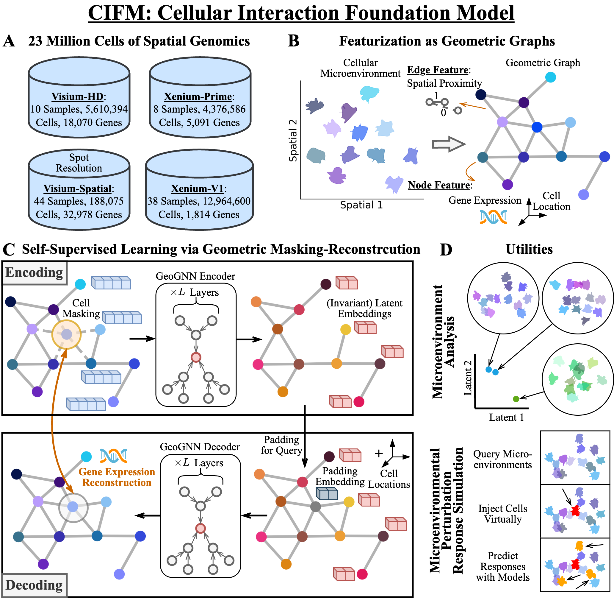
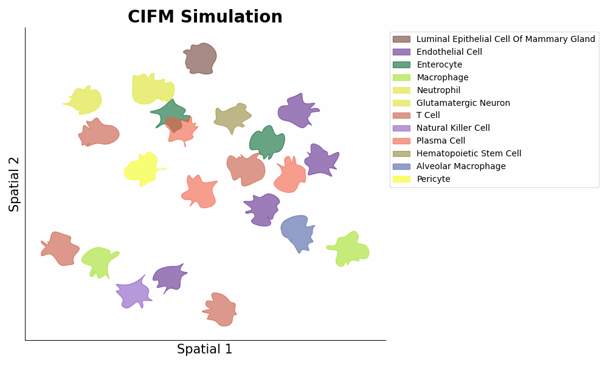

# CIFM: Cellular Interaction Foundation Model

## Overview
CIFM is an AI foundation model that can simulate the activities within living tissues (AI virtual tissue).
The signature functions of CIFM are:
- **Embedding** of celllular microenvironments via ```embeddings = model.embed(adata)``` (the 1st Figure below panel D top);
- **Inference/simulation** of cellular gene expressions within a certain microenvironment via ```expressions = model.predict_cells_at_locations(adata, target_locs)``` (the 1st Figure below panel D bottom, and the 2nd Figure below).

More information about the model can be found in the [preprint](https://www.biorxiv.org/content/10.1101/2025.01.25.634867v1).




## Model Checkpoints
- CIFM-100M [[huggingface]](https://huggingface.co/ynyou/CIFM)

## Citation
If you use this code for you research, please cite our paper.
```
@article{you2025building,
  title={Building Foundation Models to Characterize Cellular Interactions via Geometric Self-Supervised Learning on Spatial Genomics},
  author={You, Yuning and Wang, Zitong and Fleisher, Kevin and Liu, Rex and Thomson, Matt},
  journal={bioRxiv},
  pages={2025--01},
  year={2025},
  publisher={Cold Spring Harbor Laboratory}
}
```
